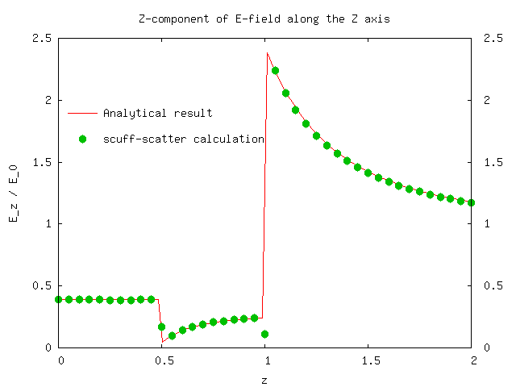
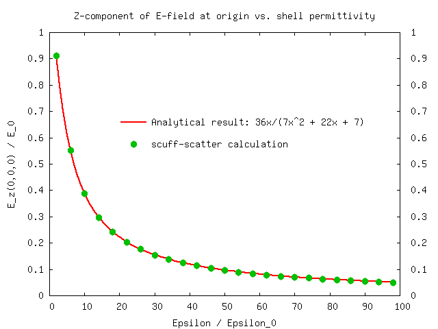

# Electrostatics of a spherical dielectric shell

For our next trick, we'll consider a spherical shell of dielectric material illuminated 
by a plane wave of such low frequency that we may think of the incident field as a 
spatially constant DC electric field. In this case it is easy to obtain an 
[exact analytical solution of the scattering problem,](SphericalShellElectrostatics.pdf) 
which we will reproduce numerically using [[scuff-scatter]]. We will take the outer and 
inner radii to be *R<sub>out</sub>=1* and *R<sub>in</sub>=0.5.* The files for this example 
are in the `share/scuff-em/examples/SphericalShell` subdirectory of the [[scuff-em]] 
source distribution.

To represent a spherical shell in [[scuff-em]], we need two surface meshes, one each for 
the inner and outer spherical surfaces. These are described by [[gmsh]] mesh files 
`Sphere_R1P0.msh` and `Sphere_R0P5.msh` We describe the shell as an inner vacuum sphere 
embedded in the outer sphere; the geometry file for this situation is 
`SphericalShell.scuffgeo:`

````bash
 OBJECT OuterSphere 
     MESHFILE Sphere_R1P0.msh
     MATERIAL CONST_EPS_10
 ENDOBJECT 
  
 OBJECT InnerSphere 
     MESHFILE Sphere_R0P5.msh
     MATERIAL Vacuum
 ENDOBJECT 
````


We will run two separate calculations. First, we will fix the relative permittivity 
of the shell at ε<sup>r</sup>=10 and look at the *z* component of the electric field 
at points on the *z* axis ranging from the origin (the center of the concentric spheres) 
to the exterior medium. We create a file called [`LineOfPoints`](LineOfPoints) which 
lists the Cartesian coordinates of each evaluation point:

````bash
      0.0 0.0 0.000
      0.0 0.0 0.025
      0.0 0.0 0.050
      ...
      0.0 0.0 2.000
````

We will pass this file to [[scuff-scatter]] using the `--EPFile` option:

````bash
     % scuff-scatter --EPFile LineOfPoints < Args
````

where the `Args` file looks like this:

````bash
      geometry       SphericalShell.scuffgeo
      cache          SphericalShell.cache
      omega          0.001
      pwDirection    1.0 0.0 0.0
      pwPolarization 0.0 0.0 1.0
````

Note that we choose a frequency low enough to ensure we are well within the 
electrostatic limit, and that the constant *z*-directed electrostatic field 
described in the memo above becomes a linearly polarized plane wave traveling 
in the *x-* direction.

This run of the code produces files `SphericalShell.scattered` and `SphericalShell.total`. 
Plotting the 8th vs. the 3rd column of the latter file (look at the first few lines
of the file for a description of which column is which) yields plot 
of the real part of *E<sub>z</sub>* vs. *z* and 
yields good agreement with the analytical calculation, 
modulo some funkiness at points on or near the boundary surfaces which is to be 
expected in an SIE/BEM calculation:



Next, we will vary the shell permittivity and look at the electric field 
at the center of the shell. In this case the 
[analytical solution](SphericalShellElectrostatics.pdf)
makes the interesting prediction


which we will try to verify numerically.

This calculation is slightly trickier than the last one, because [[scuff-scatter]] doesn't offer 
command-line options for varying the dielectric constant of an object. One way around this is to 
use the python interface to [[scuff-em]], as discussed 
[on this page][PythonInterface].
Here we will pursue a different solution involving a shell script that modifies 
the `.scuffgeo` file for each different value of ε we want to simulate. That script 
looks like this:

````bash
#!/bin/bash

cat EpsValues | while read EPS
do

  # copy the .scuffgeo file with EPS_10 replaced by EPS_xx
  sed "s/EPS_10/EPS_${EPS}/" SphericalShell.scuffgeo > temp.scuffgeo

  # run scuff-scatter to get E-field at origin
  /bin/rm -f CenterPoint.total
  /bin/rm -f CenterPoint.scattered
  scuff-scatter --geometry temp.scuffgeo --EPFile CenterPoint < Args

  # extract the z-component of the field from the output file
  EZ=`awk '{print $8}' CenterPoint.total`
  echo "${EPS} ${EZ}" >> EzVsEps.dat

done
````

(Here `EpsValues` is a file containing the values of ε 
that we want to simulate, and `CenterPoint` is a file containing 
just the first line of the file `LineOfPoints` for the cartesian 
coordinates of the origin.)

The result of the calculation looks like this:




[PythonInterface]:                http://homerreid.com/scuff-em/libscuff/python.shtml
