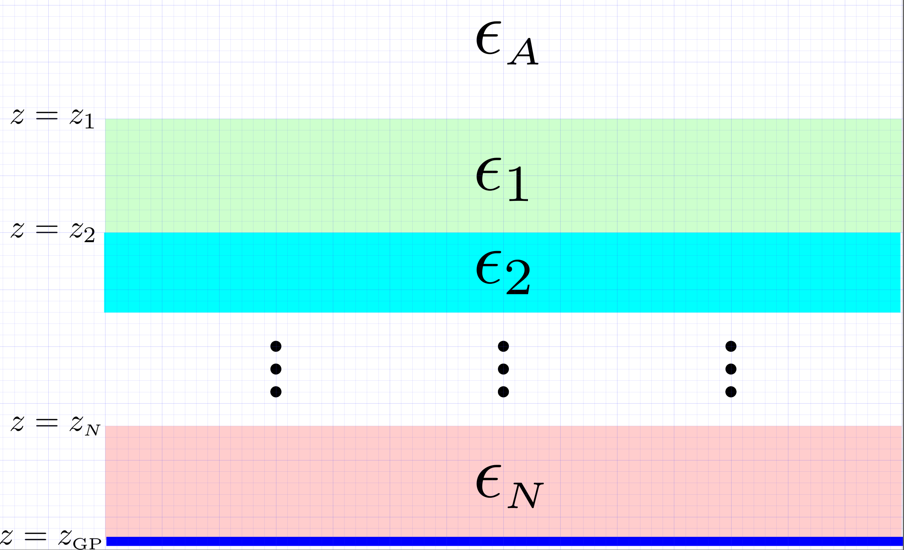
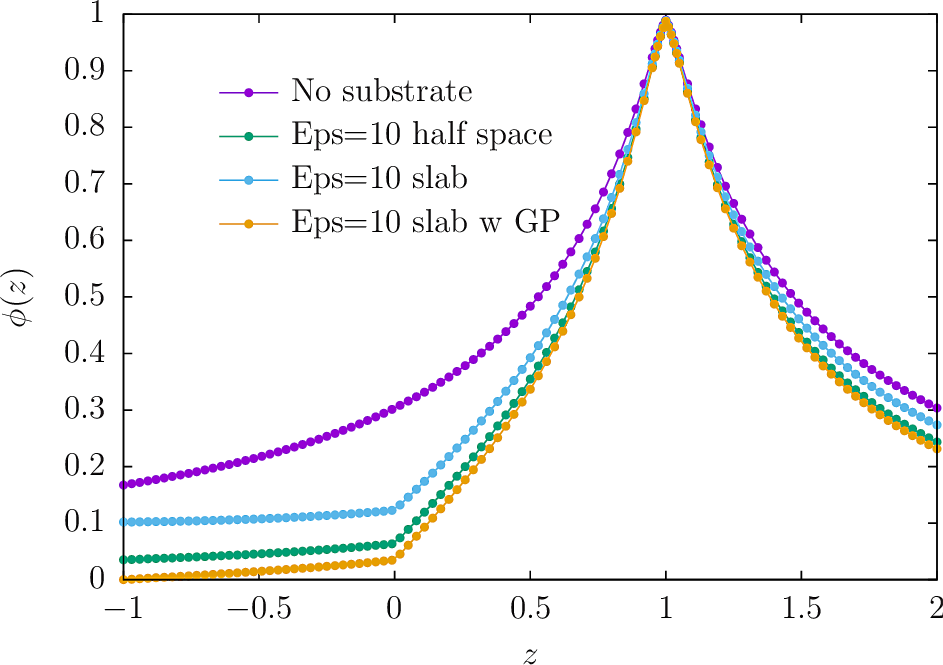

# Implicit treatment of layered dielectric substrates in <span class="SC">scuff-static</span>

In this example, we exploit [[scuff-static]]'s ability to
handle multilayered material substrates *implicitly*---with
no explicit meshing of substrate layers required---to allow 
highly efficient modeling of the electrostatics of
complex-shaped metallic traces on printed circuit boards.

The input files for the calculations discussed here
may be
found in the `share/scuff-em/examples/ImplicitSubstrate` subdirectory
of your <span class=SC>scuff-em</span> installation.

Also, the mathematical techniques involved are discussed
in [this memo][SubstrateMemo].

<a name="SubstrateFile">
## Layered substrates in <span class="SC">scuff-em</span>: The `.substrate` file

Layered substrates in [[scuff-em]] consist of zero or
more planar material layers, of arbitrary user-specified
thicknesses and permittivities, optionally terminated
by a perfectly-conducting ground plane. All layers are
infinitely extended in the *x* and *y* directions.



As is clear from this figure, an *N*-layered substrate is fully specified
by giving, for layers *n=1,2,...,N*,

+ $z_n$, the $z$-coordinate of the upper surface of the $n$th layer
+ $\epsilon_n$, the permittivity of the $n$th layer

together with

+ an optional specification of the $z$-coordinate of the terminating
  ground plane, if present
+ an optional specification of the dielectric function 
  $\epsilon_A$ of
  the ambient (or "above") medium, if it is not vacuum.

This information is specified to [[scuff-em]] in the form
of a simple text file conventionally given the file extension `.substrate.`
Each line of this file [blank lines and comments (lines beginning with `#`)
are ignored] describes one of the following items:

**(a)** a single layer in a multilayered substrate, specified by the
*z*-coordinate of its upper surface and a 
[<span class=SC>scuff-em</span> material designation][scuffMaterials], or

**(b)** the permittivity of the ambient (above) medium (if not
vacuum) specified by the keyword `MEDIUM` followed by a
[<span class=SC>scuff-em</span> material designation][scuffMaterials], or

**(c)** the *z*-coordinate of the optional ground plane followed by 
the keyword `GROUNDPLANE.`

## Examples of `.substrate` files

+ An infinite dielectric half-space of relative permittivity $\epsilon$=10
occupying the region $z<0$:

```
0.0 CONST_EPS_10
```

+ A finite-thickness (1 length unit) slab of $\epsilon=10$ suspended in space with vacuum
above and below:

```
 0.0 CONST_EPS_10
-1.0 VACUUM
```

+ A finite-thickness (1 length unit) slab of $\epsilon=10$ terminated below
by a ground plane:

```
 0.0 CONST_EPS_10
-1.0 GROUNDPLANE
```

+ An alternating stack of silicon dioxide and silicon layers above 
an infinitely-thick slab of silicon:

```
 0.0 SIO2
-0.1 SILICON
-0.2 SIO2
-0.3 SILICON
```

## Running <span class="SC">scuff-static</span> calculations with implicit substrates: The `--substrate` option

To run electrostatics calculations in the presence of a multilayer
dielectric substrate described by the file `MySubstrate.substrate`,
simply add the option `--substrate MySubstrate.substrate`
to the <span class=SC>scuff-static</span> command line.

You may set the environment variable `SCUFF_SUBSTRATE_PATH`
to define a colon-separated list of directories in which
to search for `.substrate` files. (The current working
directory is always searched first.)

## First computational example: Electric fields near a charged metallic plate 

In this simple example, I consider a small finite-size metallic plate
maintained at a constant potential of +1V in the vicinity of

**(a)** no substrate

**(b)** an infinite dielectric half-space of relative permittivity
        $\epsilon_r=10$ filling the lower half-space $z\lt 0$

**(c)** a finite-thickness (thickness one length unit)
        slab of relative permittivity $\epsilon_r=10$
        filling the lower half-space $z\lt 0$

**(d)** a finite-thickness slab of $\epsilon_r=10$ lying atop a ground plane.

Input files for this example may be
found in the `share/scuff-em/examples/ImplicitSubstrate` subdirectory
of your [<span class=SC>scuff-em</span> installation.][scuffInstallation].

The <span class=SC>bash</span> script I use to run this example is 
`RunScript`: 

````
#!/bin/bash

CODE=scuff-static

ARGS=""
ARGS="${ARGS} --geometry       Square_40.scuffgeo"
ARGS="${ARGS} --potentialfile  PotentialFile"
ARGS="${ARGS} --EPFile         EPFile.Fields"


${CODE} ${ARGS} --filebase None

for SUBSTRATE in E10HalfSpace E10SlabGP E10Slab
do
  ${CODE} ${ARGS} --substrate ${SUBSTRATE}.substrate --filebase ${SUBSTRATE}
done

````

This computes the electrostatic potential and fields along a line
of evaluation points at fixed $x,y$ coordinates running from 
$z=2$ (above the plate) to $z=-1$ (the ground plane) 
and passing through the plate at $z=1$ and the dielectric interface
at $z=0$.
The results are plotted in 
<span class=SC>gnuplot</span> by saying `load Plotter.Fields`,
where `Plotter.Fields` is [this script](Plotter.Fields).



Take-home messages:

+ The potential rises to $\phi=1$ at the location of the plate ($z=1$).

+ In the presence of the $\epsilon=10$ substrate, the potential exhibits
  a kink at the air-substrate interface ($z=0$) that is absent for the
  "No substrate" curve.

+ In the presence of the implicit ground plane at $z=-1$, 
  the potential properly tends to zero at $z=-1$ (yellow curve).

## Second computational example: Capacitance of metallic pad on grounded PCB

--------------------------------------------------

[GMSH]:                 http://www.geuz.org/gmsh
[scuffInstallation]:    ../../reference/Installing
[scuffMaterials]:       ../../reference/Materials
[SubstrateMemo]:	../../tex/StaticDielectricSubstrate.pdf
