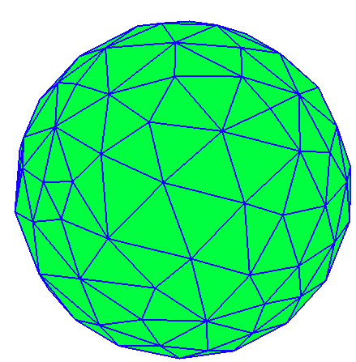
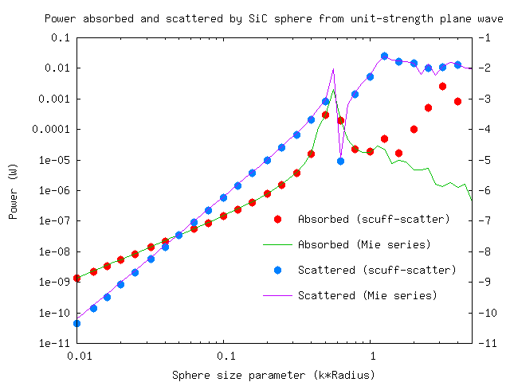
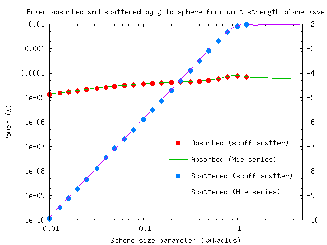
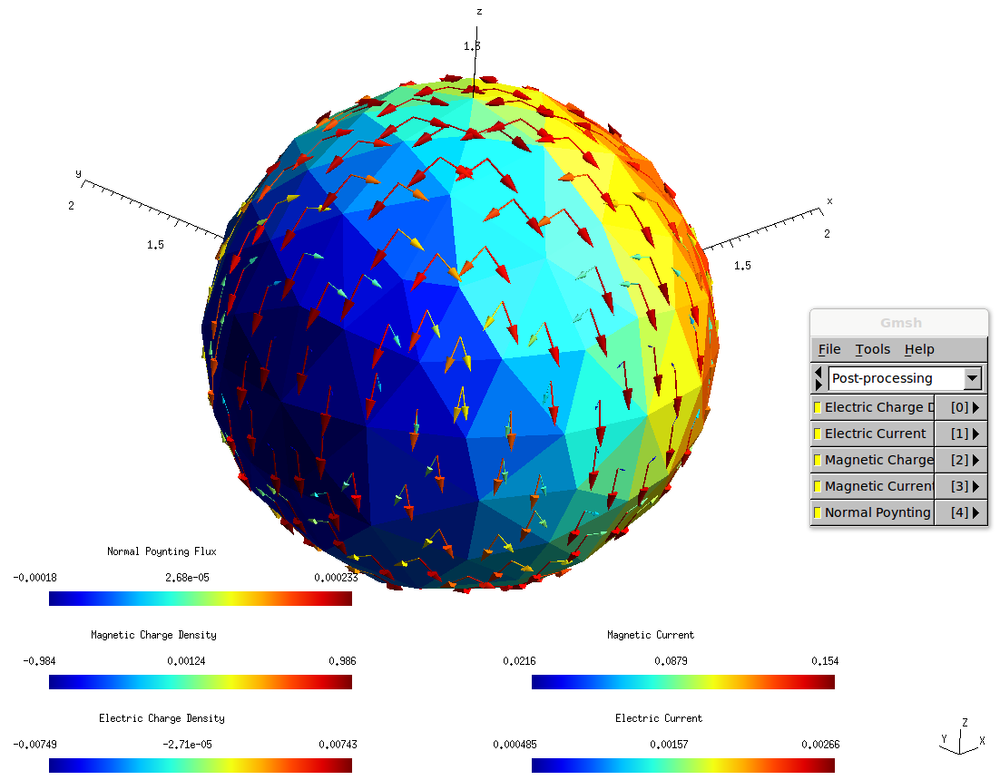

# Plane-wave scattering from a dielectric sphere (Mie scattering)

We first demonstrate how to use [[scuff-scatter]] to solve the canonical textbook 
problem of *Mie scattering* -- the scattering of a plane wave from a dielectric 
sphere. The files for this example are in 
the `share/scuff-em/examples/SolidSphere` subdirectory of the [[scuff-em]]
source distribution.

We begin by creating a [<span class="SC">gmsh</span>](http://geuz.org/gmsh) geometry file for the 
sphere [(`Sphere.geo`)](Sphere.geo). We turn this geometry file into a mesh 
file by running the following command:

````bash
 % gmsh -2 -clscale 1.0 Sphere.geo
````

This produces a file named [`Sphere.msh`](Sphere.msh) which looks like this:



You can adjust the fineness of the surface mesh by varying the `-clscale` parameter 
(which stands for "characteristic length scale"); finer meshes will be more accurate 
but will take longer to simulate.

Next we create a [<span class="SC">scuff-em</span> geometry file][scuffEMGeometries]
that will tell [[scuff-scatter]] about our geometry, including both the surface mesh 
and the material properties (dielectric function) of the sphere. As a first example, 
we'll use a dielectric model for silicon carbide that expresses the relative 
permittivity as a rational function of ω; in this case we'll call the geometry 
file `SiCSphere.scuffgeo.`

````bash 
MATERIAL SiliconCarbide
   
   EpsInf = 6.7;
   a0     = -3.32377e28;
   a1     = +8.93329e11;
   b0     = -2.21677e28;
   b1     = 8.93329e11;
   Eps(w) = EpsInf * (a0 + i*a1*w + w*w) / ( b0 + i*b1*w + w*w);

ENDMATERIAL 

OBJECT TheSphere
        MESHFILE Sphere.msh
        MATERIAL SiliconCarbide
ENDOBJECT
````

We create a simple file called [`OmegaValues.dat`](OmegaValues.dat) containing a 
list of angular frequencies at which to run the scattering problem:

````bash
    0.010
    0.013
    ...
    10.0
````

(We pause to note one subtlety here: Angular frequencies specified 
using the `--Omega` or `--OmegaFile` arguments are interpreted in 
units of $c / 1 \mu$m = $3\cdot 10^{14}$ rad/sec.
These are natural 
frequency units to use for problems involving micron-sized objects; 
in particular, for Mie scattering from a sphere of radius 1 μm, as 
we are considering here, the numerical value of `Omega` is just the 
quantity $kR$ (wavenumber times radius) known as the 
"size parameter" in the Mie scattering literature. In contrast, 
when specifying functions of angular frequency like `Eps(w)` in 
`MATERIAL...ENDMATERIAL` sections of geometry files or in any other 
[<span class="SC">scuff-em</span> material description][scuffEMMaterials], 
the `w` variable 
is always interpreted in units of **1 `rad/sec`**, because these are 
the units in which tabulated material properties and functional forms 
for model dielectric functions are typically expressed.)

Finally, we'll create a little text file called `Args` that will contain 
a list of command-line options for [[scuff-scatter]]; these will include 
**(1)** a specification of the geometry, **(2)** the frequency list, 
**(3)** the name of an output file for the power, force, and torque 
**(4)** the name of a cache file for geometric data (this file doesn't 
exist yet, but will be created by our first run of [[scuff-scatter]]), 
and **(5)** a specification of the incident field.

````bash
    geometry SiCSphere.scuffgeo
    OmegaFile OmegaValues.dat
    PFTFile SiCSphere.PFT
    Cache Sphere.cache
    pwDirection 0 0 1
    pwPolarization 1 0 0
    
````

And now we just pipe this little file into the standard input of 
[[scuff-scatter]]:

````bash
    % scuff-scatter < Args 
````

This produces the file `SiCSphere.PFT`, which contains one line per simulated 
frequency; each line contains data on the scattered and total power, the force, 
and the torque on the particle at that frequency. (Look at the first few lines
of the file for a text description of how to interpret it.)

(On my fairly standard workstation (8 Xeon E5420 cores, 2.5 GHz), this calculation 
takes a few minutes to run. You can monitor its progress by following the `scuff-scatter.log` 
file. Note that, during computationally-intensive operations such as the BEM matrix assembly, 
the code should be using all available CPU cores on your workstation; if you find that this is 
not the case (for example, by monitoring CPU usage using 
[<span class="SC">htop</span>](http://htop.sourceforge.net)) 
you may need to 
[reconfigure and recompile with different openmp/pthreads configuration options.][scuffEMInstallation.shtml]

Here's a comparison of the [[scuff-scatter]] results with the analytical Mie series, as computed 
using [this Mathematica script.](Mie.math) [Like most Mie codes, this script computes the 
absorption and scattering *cross-sections*, which we multiply by the incoming beam flux ($\frac{1}{2Z_0}$ for a unit-strength plane wave in vacuum) to get 
values for the absorbed and scattered *power*.]



Now let's redo the calculation for a sphere made of gold instead of silicon carbide.  In this case we will name our [[scuff-em]] geometry file `GoldSphere.scuffgeo`:

````bash
    MATERIAL Gold
      wp = 1.37e16;
      gamma = 5.32e13;
      Eps(w) = 1 - wp^2 / (w * (w + i*gamma));
    ENDMATERIAL

    OBJECT TheSphere
        MESHFILE Sphere.msh
        MATERIAL Gold
    ENDOBJECT
    
````

Since most of the command-line arguments to [[scuff-scatter]] will be the same as before, 
we can reuse the same `Args` file, with the options that need to be given new values 
specified on the command line:

````bash
% scuff-scatter --geometry GoldSphere.scuffgeo --PFTFile GoldSphere.PFT < Args
    
````

(Note that we don't have to change the name of the cache file specified with the `Cache` 
option; because we are using the same surface mesh as before, and because 
[cached geometric data in <span class="SC">scuff-em</span> are independent of material properties](http://homerreid.com/scuff-em/reference/scuffEMMisc.shtml#Caching), 
we can take advantage of geometric data computed during the earlier run for the silicon carbide sphere.)

Now our data look like this:



In some cases it's useful to look at how the induced surface currents vary over the surface of the object. 
Let's re-run the SiC example, now at just the single angular frequency of ω=0.1, and ask for a surface current plot.

````bash
% scuff-scatter --geometry SiCSphere.scuffgeo --Omega 0.1 --Cache Sphere.cache --pwDirection 0 0 1 --pwPolarization 1 0 0 --PlotSurfaceCurrents
````

This produces a file named `SiCSphere.0.1.pp`, which we can open in gmsh like this:

````bash
 % gmsh SiCSphere.0.1.pp
````



[scuffEMGeometries]:                  ../../reference/Geometries.md
[scuffEMMaterials]:                   ../../reference/Materials.md
[scuffEMInstallation]:                ../../reference/Installation.md
