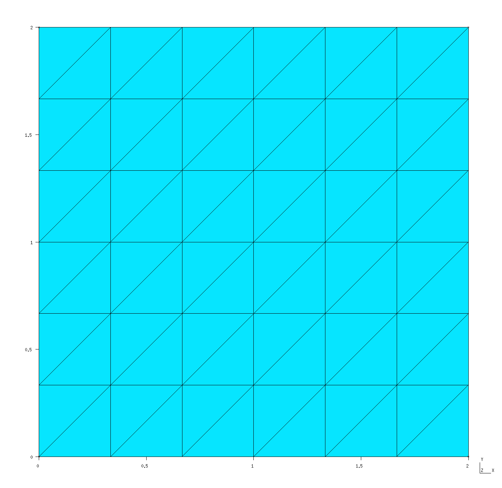

<h1>Casimir forces between infinite-area silicon slabs (2D periodicity)</h1> 

In this example, we exploit [[scuff-em]]'s
[support for 2D periodic geometries][ExtendedGeometries]
to compute the equilibrium Casimir force per unit area
between silicon slabs of infinite surface area.
The files for this example may be found in the
`share/scuff-em/examples/SiliconSlabs` subdirectory
of your [[scuff-em]] installation.

--------------------------------------------------

## [[gmsh]] geometry file for unit-cell geometry 

The [[gmsh]] geometry file [`Square_N.geo`](Square_N.geo)
describes the portion of the surface of a single
slab that lies within the *unit cell,*
i.e. the cell that is infinitely periodically
replicated to yield the full geometry.
In this case, the slab is infinitely thick (it is a 
half-space), so its surface consists of just a single
two-dimensional sheet extending throughout the entire
unit cell. I call this file `Square_N.geo` to 
remind myself that it contains a parameter `N` 
that describes the meshing fineness; more specifically,
`N` defines the number of segments per unit length.

To produce a discretized surface-mesh
representation of this geometry, we run it through 
[[gmsh]]:

````bash
% gmsh -2 Square_N.geo
````

This produces the file `Square_N.msh`, which
I rename to `Square_L2.40.msh` because the side length
of the square is $L=2\,$\mu\text{m}$ and because
this particular mesh has 40 interior edges (this
number defines the number of RWG basis functions
and thus the size of the BEM matrix in a
[[scuff-em]] calculation). Editing the `.geo` file
to change the `N` parameter to 3 (from its default 
value of 2) and re-running `gmsh -2` produces a
finer mesh file, which I rename to `Square_L2_96.msh`.
These meshes may be visualized in [[gmsh]]:

````bash
% gmsh Square_L2_40.msh
% gmsh Square_L2_96.msh
````

** `Square_L2_40.msh`**


** `Square_L2_96.msh`**



Note the following:

 * For 2D periodic geometries in [[scuff-em]], the 
   lattice vectors must lie in the $xy$ plane.

 * For surfaces that straddle the unit-cell boundaries
   (as is the case here), each triangle edge that lies
   on any edge of the unit cell must have an identical
   image edge on the opposite side of the unit cell.
   An easy way to achieve this is to use *extrusions*
   in [[gmsh]], as in the `.geo` file above.

 * In this case the unit cell dimensions are 
   $L_x\times L_y$ where $L_x=L_y=2\, \mu\text{m}$.
   (More generally, $L_x$ and $L_y$ may be any arbitrary
   nonzero values, and they need not equal each other.)

--------------------------------------------------

## [[scuff-em]] geometry file 

--------------------------------------------------

## [[scuff-em]] transformation file 

--------------------------------------------------

## Launching the run

````bash
# /bin/bash

for N in 40 192
do
  ARGS=""
  ARGS="${ARGS} --geometry   SiliconSlabs_L2_N${N}.scuffgeo"
  ARGS="${ARGS} --TransFile  Beams.trans"
  ARGS="${ARGS} --BZSymmetry BZSymmetry"
  ARGS="${ARGS} --energy"
  ARGS="${ARGS} --zForce"

  scuff-cas3D ${ARGS}
done
````

[ExtendedGeometries]: ../../reference/Geometries.md#Extended
[scuffEMGeometries]: ../reference/Geometries
[scuffEMTransformations]: ../reference/Transformations
[RoundedBeamUnitCellGeo]: RoundedBeamUnitCell.geo
[SiliconBeamsScuffgeo]: SiliconBeams_192.scuffgeo
