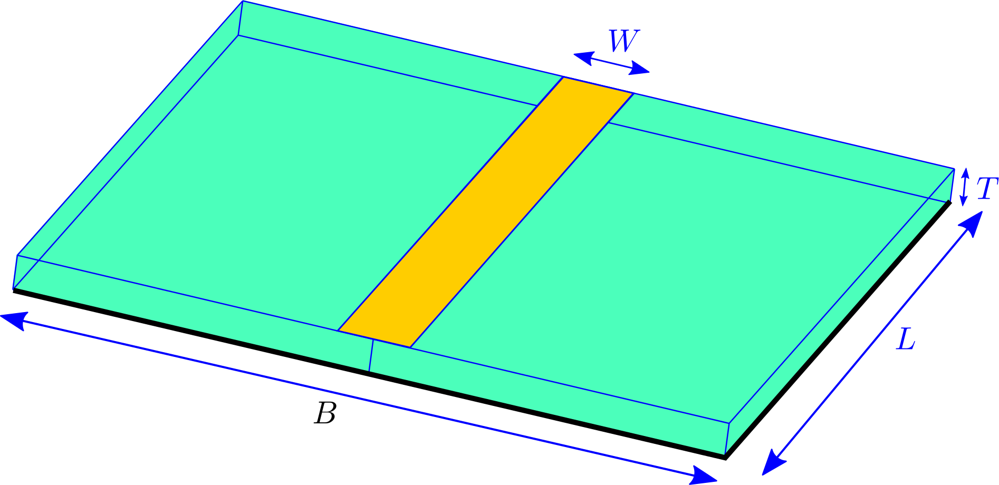
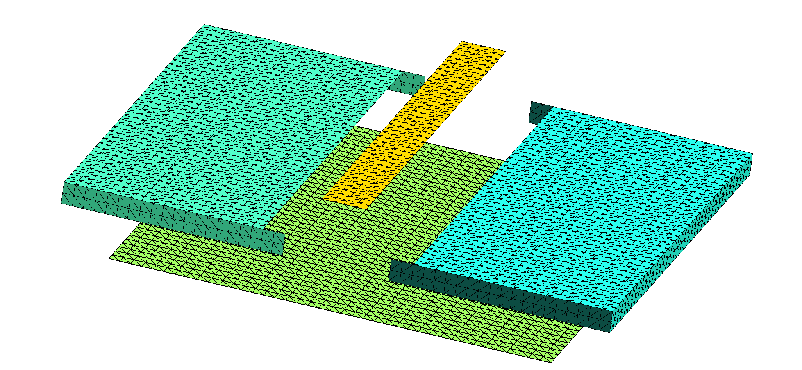

# Capacitance of a PCB stripline trace

In this example, we use [[scuff-static]] to compute the
capacitance of a metal trace on an FR4 printed circuit board (PCB)
with ground plane. Here's a schematic depiction:



Here the green region is dielectric, the yellow region
is an (infinitesimally thin) metallic trace on the upper surface
of the dielectric, and black indicates a ground plane
on the bottom surface of the dielectric.

## [[gmsh]] and <span class="SC">scuff-em</span> geometry files

Due to the presence of [multi-material junctions][MMJs]
(points at which three or more material regions meet, which in the 
figure above occur along the edges of the metal trace and the
ground plane), the geometry cannot be described as a collection
of 3D volumes bounded by closed surfaces, and instead requires
a more sophisticated geometry description in terms of
[*regions* and *surfaces*][MMJs]. More specifically, there
are only two regions in the problem (the exterior vacuum region
and the dielectric), but there are three distinct surfaces:
 **(1)** the metal trace, **(2)** the dielectric-air interface, 
and **(3)** the ground plane.
To define a [[scuff-em]] geometry description
for this case, we need separate meshes for each of these
three surfaces. The following picture shows these three surface
meshes, displaced for clarity from their positions in the actual
geometry:



Here's a [<span class="SC">gmsh</span>][GMSH] geometry file
defining the various surfaces we need; note that this file makes
three `Physical Surface` statements to define surfaces **(1)**, **(2)**, 
and **(3)** above. 

 + [`StriplineCapacitor.geo`](StriplineCapacitor.geo)

This file contains user-specifiable parameters
`W`, `L`, `T`, and `B` corresponding to the geometric quantities 
labeled in the figure above, as well as a user-specifiable parameter `N`
setting the number of triangles per unit length. I generate surface
meshes at two different resolutions like this:

```bash
% gmsh -2 -setnumber N 2 StriplineCapacitor.geo
% gmsh -2 -setnumber N 4 StriplineCapacitor.geo
```

These produce `.msh` files containing respectively 1948 and 7856
inner triangle edges (you can get this information by running
`scuff-analyze --mesh StriplineCapacitor.msh`), so I rename them
to `StriplineCapacitor_1948.msh` and 
`StriplineCapacitor_7856.msh.`

Next I write a [<span class="SC">scuff-em</span> geometry file][scuffGeometries]
for each meshing resolution. This file defines the two regions and
the three surfaces defined above, specifying that the meshes for
each surface
are to be read from the `.msh` file with the appropriate `Physical Surface`
tag.
For the coarser-resolution mesh the file is called
 [`StriplineCapacitor_1948.scuffgeo`](StriplineCapacitor_1948.scuffgeo),
and it looks like this:

```
REGION Exterior   MATERIAL Vacuum
REGION Dielectric MATERIAL CONST_EPS_4

OBJECT Trace
    MESHFILE StriplineCapacitor_1948.msh
    MESHTAG 1
ENDOBJECT

SURFACE RightBoundary
    MESHFILE StriplineCapacitor_1948.msh
    MESHTAG 2
    REGIONS Exterior Dielectric
ENDSURFACE

SURFACE LeftBoundary
    MESHFILE StriplineCapacitor_1948.msh
    MESHTAG 2
    ROTATED 180 ABOUT 0 0 1
    REGIONS Exterior Dielectric
ENDSURFACE

OBJECT GroundPlane
    MESHFILE StriplineCapacitor_1948.msh
    MESHTAG 3
ENDOBJECT
```

Some notes on this geometry description:

 + Since the default material for an `OBJECT` or `SURFACE`
is PEC (**P**erfectly **E**lectrically **C**onducting), I
don't need to include a `Material` specification for the
trace or the ground plane.

 + I have broken up surface 2 (dielectric--vacuum interface)
 into two halves, described by identical surface meshes 
 with one rotated 180 degrees around the *z* axis. This is 
not necessary, but it saves a little time in the matrix 
assembly, as the diagonal matrix blocks corresponding to the
two half-surfaces are identical and thus only need to be 
computed once.

 + This geometry specification is perfectly adequate for
electrostatic problems, but would be not quite right for
finite-frequency problems. For such problems I would 
instead want to define the trace and ground plane 
as regions of (in this case, infinite) surface conductivity
on a closed dielectric boundary surface.

 + Having written this `.scuffgeo` file for the coarser of my two
surface meshes, I can obtain one for the finer mesh by going like
this:

```
 BASE=StriplineCapacitor
 sed 's/1948/7856/g' ${BASE}_1948.scuffgeo > ${BASE}_7856.scuffgeo
```

## Calculation of capacitance matrix

````
for 
 scuff-static --geometry ${GEOM}.scuffgeo 
StriplineCapacitor_1948.scuffgeo --CapFile

## Calculate capacitance matrix

## Capacitance vs. PCB thickess

--------------------------------------------------

[MMJs]:        ../../reference/Geometries#Complex
[GMSH]:                        http://www.geuz.org/gmsh
[scuffGeometries]:        ../../reference/Geometries
