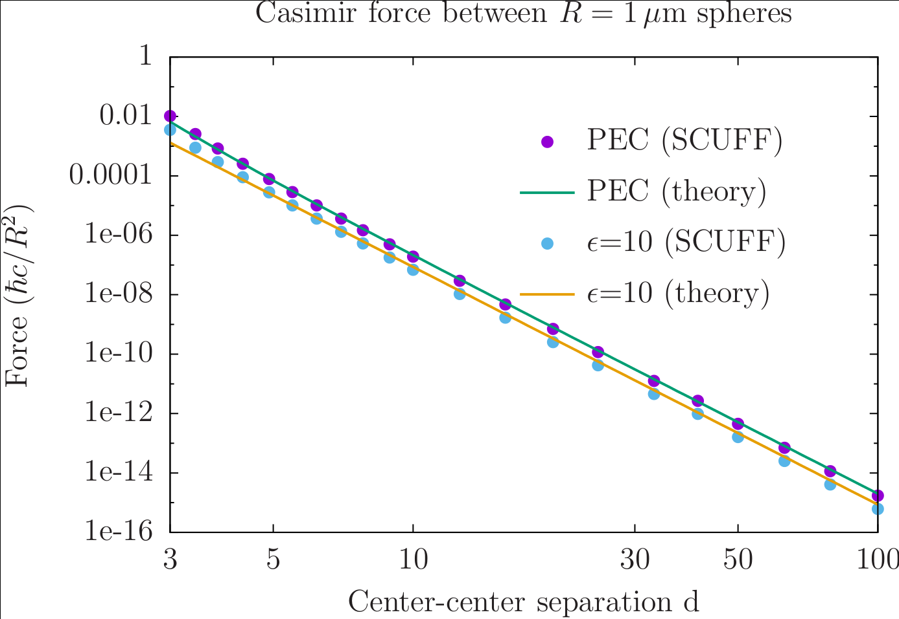

# Equilibrium Casimir forces between spheres

This test validates the [<span class=SC>scuff-cas3d</span>][scuff-cas3d]
of the [[scuff-em]] code suite by using it to compute
the equilibrium Casimir force between identical spheres
at various separation distances. We consider both
perfectly electrically conducting (PEC) 
and dielectric spheres.

## Analytical solution

An analytical formula for the distance-dependent Casimir energy
of two identical PEC spheres of radius $R$ separated by a
distance $d$ was obtained by T. Emig et al. in this paper:

* [T. Emig, N. Graham, R. L. Jaffe, and M. Kardar, "Casimir forces between arbitrary compact objects." *Physical Review Letters* **99** 170403 (2007).][EmigPaper]

Their asymptotic ($d\gg R$) formula for the energy, and the force
formula obtained by differentiating it, are

$$ E(d) = -\frac{\hbar c}{\pi R}   \sum_{n=7}^\infty C_n \left(\frac{R}{d}\right)^n $$
$$ F(d) = -\frac{\hbar c}{\pi R^2} \sum_{n=7}^\infty n C_n \left(\frac{R}{d}\right)^{n+1}$$

where the first few $C$ coefficients are

* for PEC spheres:
  $$C_7=\frac{143}{16}, \quad C_9=\frac{7947}{160}, \quad C_{10}=\frac{2065}{32}$$

* for dielectric spheres with static $(\omega \to 0)$ 
  relative permittivity $\epsilon$:
  $$C_7=\frac{23}{4}\left(\frac{\epsilon-1}{\epsilon+2}\right)^2$$

## <span class="SC">scuff-em</span> solution

The Casimir energy and force between two PEC spheres
and between two dielectric spheres may be computed
using [[scuff-cas3d]] as follows:

````bash
 % scuff-cas3d --geometry PECSpheres_501.scuffgeo --translist Spheres.trans --energy --zforce
 % scuff-cas3d --geometry E10Spheres_501.scuffgeo --translist Spheres.trans --energy --zforce
````

Here the two `.scuffgeo` files 
([`PECSpheres_501.scuffgeo`](PECSpheres_501.scuffgeo) and [`E10Spheres_501.scuffgeo`](E10Spheres_501.scuffgeo)]
describe the two geometric configurations
(two PEC spheres and two dielectric spheres of radius $R=1\, \mu$m 
separated by an initial center-center distance of $d$=3 $\mu$m) while
[`Spheres.trans`](Spheres.trans) specifies the list of center-center 
separation distances $d$ at which we compute the energy and force.
(Both geometries refer to the same surface mesh file for the 
sphere, [`Sphere_327.msh`](Sphere_327.msh).

The above calculations produce output files named 
[`PECSpheres_327.out`](PECSpheres_327.out) and 
[`E10Spheres_327.out`](E10Spheres_327.out). Plotting against
the theoretical predictions of Emig et. al (referenced above)
yields good agreement:

.

Here's the [[gnuplot]] script I used to produce this 
plot: [`Plotter.gp`](Plotter.gp).

[EmigPaper]:                          http://journals.aps.org/prl/abstract/10.1103/PhysRevLett.99.170403

{!Links.md!}
